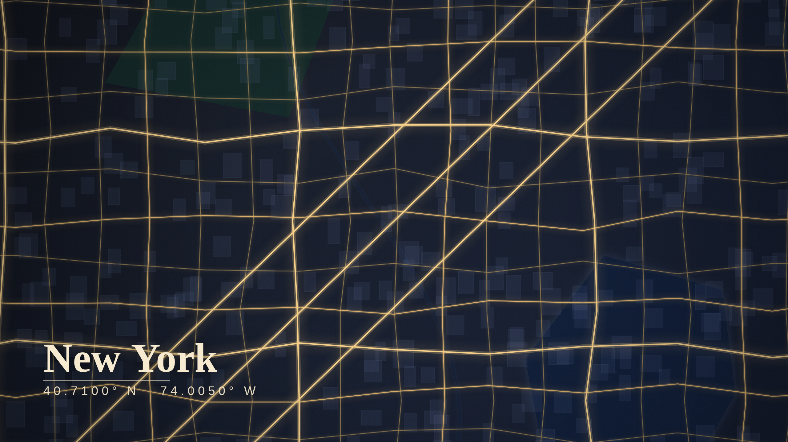

# 🗺️ Cartogram — Map Artwork Background Builder

Draw a box on a map and turn **any place on Earth** into a stunning, artistic
desktop (or phone) wallpaper. Not a screenshot — a piece of generative artwork
that keeps the real roads, water, parks and buildings of the place you chose,
rendered in a hand‑tuned palette with glow, depth and typography.

**100% client‑side.** No backend, no API keys, no build step. It runs entirely
in the browser and is hosted for free on GitHub Pages.



## ✨ Features

- **Draw‑to‑select** — search a place, then drag a box to frame your scene.
- **Real map data** — streets, rivers, coastlines, parks and buildings are
  pulled live from [OpenStreetMap](https://www.openstreetmap.org) via the
  Overpass API.
- **6 curated art styles** — Midnight Gold, Neon Noir, Blueprint, Ivory Ink,
  Sunset and Deep Forest, each with road glow, water gradients and film grain
  for a premium, non‑flat finish.
- **Wallpaper resolutions** — Full HD, 2K, 4K and phone (portrait) presets.
- **Add text** — an auto‑detected city name plus coordinates, with 9 placement
  options, two fonts, and colour choices. Everything re‑renders live.
- **One‑click PNG download** at full resolution.

## 🚀 How it works

1. A dark [Leaflet](https://leafletjs.com) map lets you find and frame an area.
2. On **Generate**, the drawn bounding box is sent to the **Overpass API**,
   which returns the raw vector geometry (roads by class, water bodies,
   waterways, parks, buildings) for that box.
3. Those vectors are projected (Web Mercator) and painted onto an HTML
   `<canvas>` with a completely custom artistic style — layered fills,
   multi‑pass road glow, vignette and grain — then framed to cover your chosen
   resolution.
4. Text is drawn as a final overlay, and the canvas is exported as a PNG.

## 🧑‍💻 Run locally

No dependencies. Just serve the folder (a static server is needed so the
browser will make the Overpass/Nominatim requests):

```bash
python3 -m http.server 8000
# then open http://localhost:8000
```

## 🌐 Deploy on GitHub Pages

This repo ships a workflow at `.github/workflows/pages.yml`.

1. Push to `main`.
2. In the repo, go to **Settings → Pages → Build and deployment** and set
   **Source** to **GitHub Actions**.
3. The site publishes automatically on every push to `main`.

(You can also use **Deploy from a branch** and point it at the repo root — the
site is plain static files.)

## 📜 Attribution

Map data © [OpenStreetMap](https://www.openstreetmap.org/copyright)
contributors. Geocoding by [Nominatim](https://nominatim.org). Basemap tiles by
[CARTO](https://carto.com). Please respect the
[Overpass](https://wiki.openstreetmap.org/wiki/Overpass_API) and Nominatim
usage policies (this app makes light, on‑demand requests).
