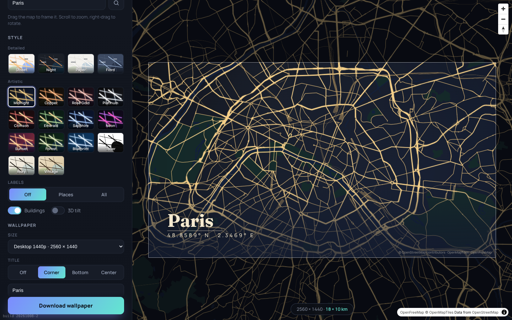

# 🗺️ Cartogram — Map Wallpaper Builder

Frame **any place on Earth**, pick a style, and download it as a crisp,
full‑resolution desktop or phone wallpaper. The map you see *is* the preview:
what's inside the frame is exactly what you get, just rendered at 4K.

**100% client‑side, no API keys.** No backend, no build step. It runs entirely
in the browser and is hosted for free on GitHub Pages.



## ✨ Features

- **Live, detailed OpenStreetMap** — streets, names, transit, parks, water and
  building footprints, from free vector tiles by [OpenFreeMap](https://openfreemap.org).
- **17 styles in two families**
  - *Detailed* (Street, Night, Paper, Fiord) — full map look with labels, POIs
    and road casings.
  - *Artistic* (Midnight, Copper, Rosé Gold, Platinum, Crimson, Emerald,
    Sapphire, Neon, Sunset, Forest, Blueprint, Toner, Ivory, Vintage) — clean
    line‑work with glow, gradients and a soft vignette.
- **Labels: Off / Places / All**, a **Buildings** switch, and **3D tilt** with
  real extruded buildings (zoom in close; right‑drag to rotate).
- **Wallpaper sizes** — your own screen (auto‑detected), 1080p, 1440p, 4K,
  MacBook 16:10, ultrawide, iPhone and Android. The frame on the map locks to
  the chosen shape.
- **Optional title** — corner, bottom or centered, serif or sans, with the
  place name and coordinates filled in for you.
- **One‑click PNG download** at full resolution.

## 🚀 How it works

1. [MapLibre GL JS](https://maplibre.org) draws OpenFreeMap's vector tiles
   (OpenStreetMap data in the [OpenMapTiles](https://openmaptiles.org) schema).
2. Every style is generated in `app.js` from one base style — a vendored
   snapshot of OpenFreeMap's *Liberty* (`vendor/styles/liberty.json`) —
   recoloured layer by layer from a small palette.
3. On **Download**, the framed view is re‑rendered off‑screen at the target
   resolution (same centre, zoom, rotation and tilt, higher pixel ratio), then
   composited with the background gradient, title and attribution, and saved as
   a PNG.

## 🧑‍💻 Run locally

No dependencies. Serve the folder with any static server (ES modules and the
map tiles need `http://`, not `file://`):

```bash
python3 -m http.server 8000
# then open http://localhost:8000
```

## 🌐 Deploy on GitHub Pages

This repo ships a workflow at `.github/workflows/pages.yml` that publishes the
site on every push to the default branch (or `main`/`master`).

1. In the repo, go to **Settings → Pages → Build and deployment** and set
   **Source** to **GitHub Actions**.
2. Push — the site publishes automatically.

## 📜 Attribution

Map data © [OpenStreetMap](https://www.openstreetmap.org/copyright)
contributors. Tiles by [OpenFreeMap](https://openfreemap.org) ·
© [OpenMapTiles](https://openmaptiles.org). Geocoding by
[Nominatim](https://nominatim.org). Exported wallpapers carry a small credit
line in the corner, as the tile and data licences require. Please respect the
[Nominatim usage policy](https://operations.osmfoundation.org/policies/nominatim/)
(this app makes light, on‑demand requests).

[MapLibre GL JS](https://github.com/maplibre/maplibre-gl-js) is vendored under
its BSD‑3‑Clause licence (`vendor/maplibre/LICENSE.txt`).
